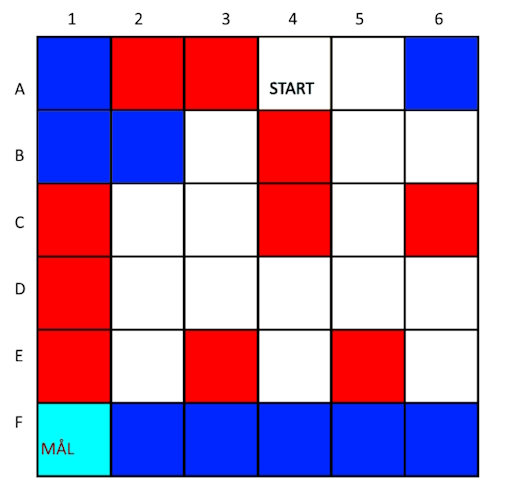

# Karaktersatt oppgave 1 | DTE-2602

I denne oppgaven skal du lage en simulering av en robot som utforsker et ukjent
terreng. For enkelhets skyld er terrenget delt opp som et rutenett med 36
tilstander. Roboten skal starte i A4 og skal prøve å finne en trygg vei frem til
F1.

Rundt om i terrenget er det ulike hindringer som roboten må ta hensyn til.

Roboten klarer å kjøre i bratt terreng, men det krever mye energi og er
forbundet med forhøyet risiko. Roboten er vanntett, men å kjøre gjennom vann
krever enda mer energi, og tar svært lang tid sammenliknet med å kjøre på land
eller i bratt terreng. Det er også blitt observert sjømonstre i vannet, men
dette kan ikke bekreftes av uavhengige kilder. Kjøring gjennom vann er derfor
forbundet med middels risiko. Basert på disse opplysningene kan vi forenkle
kartet til følgende figur.

* Røde ruter er fjell og bratt terreng, og mørkeblå ruter er vann. Hvite ruter
  er forbundet med lav eller ingen risiko.
* Roboten styres med et API som tillater følgende bevegelser: "opp", "ned",
  "høyre" og "venstre". Hvis roboten står i rute "A4" og gjør bevegelsen "ned"
  havner den altså i rute "B4" Roboten kan ikke bevege seg diagonalt.

# Oppgaver
* Fullfør robot-klassen med tilhørende reward-matrise for kartet som er oppgitt.
  Gjør egne vurderinger angående hvilke verdier som bør brukes i matrisen, og
  begrunn disse.
* Implementer Monte Carlo for å velge en av fire mulige «actions» for tilstanden
  roboten står i (opp, ned, høyre, venstre). Dersom roboten står i kanten av
  rutenettet og prøver å gå ut av kartet, skal den bli stående i samme rute.
* Utfør Monte Carlo-simulering for å finne den tryggeste stien fra start til
  mål. Plasser roboten i rute A4 og avslutt når den når rute F1. Metoden skal
  beregne total akkumulert belønning for hver simulering basert på
  reward-matrisen du satte opp. Stien med høyest belønning/lavest straff vil
  være den tryggeste ruten. Ekperimentér med å kjøre flere simuleringer. Hva er
  den beste belønningen roboten klarer å oppnå etter 10 simuleringer? Eller 100?
  Eller flere? Hvor mange simuleringer tror du roboten trenger for å finne en
  "god" sti?
* Utvid roboten til å bruke Q-learning for å utforske kartet og lære seg den
  tryggeste stien fra A4 til F1. Husk Q-matrise og policy-funksjon.
* Bruk pygame for å visualisere den tryggeste stien fra start til mål.
* Eksperimenter med å kjøre Q-learning-programmet med ulike antall episoder (og
  evt. ulike varianter av policy), og vis hvor god rute roboten finner for hvert
  eksperiment. Klarer den å finne den optimale ruta? Det kan hende du må justere
  reward-matrisa for å få gode resultater.
